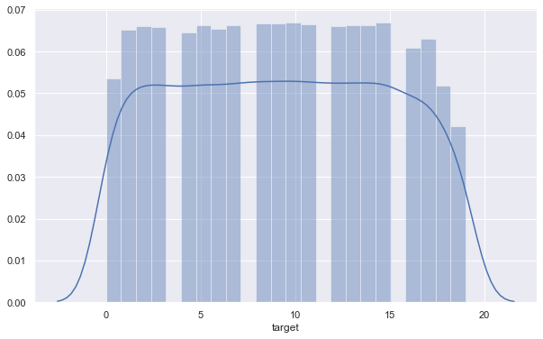
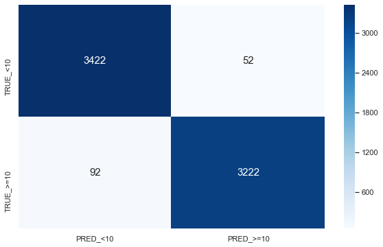
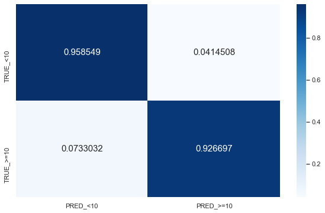
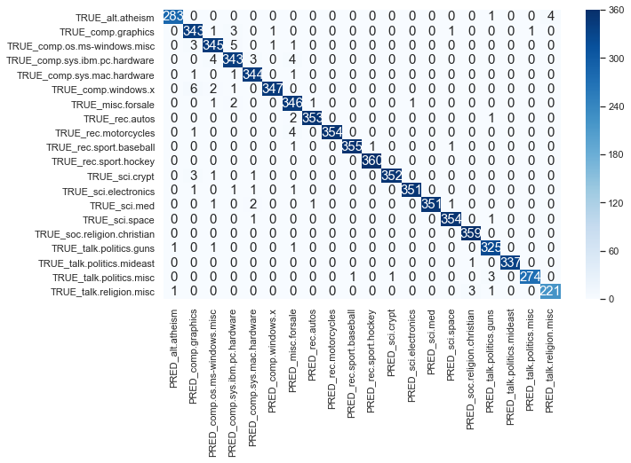
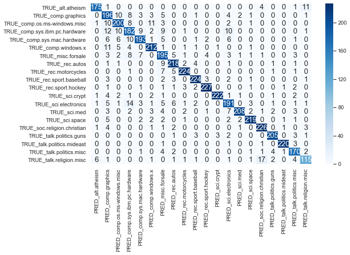

# An introduction to text classification

In this tutorial, we will explore a basic workflow to train and evaluate a model to classify text. Note that there are many important aspects not covered in what follows, such as exploratory data analysis (EDA) or hyper-parameter optimisation.

In this tutorial, we will take a real example of the `20 Newsgroups` dataset, popular among the NLP community. In this dataset, each sample is labelled as one of 20 categories, such as `religion` or `space`.


```python
from sklearn.linear_model import LogisticRegression
from sklearn.feature_extraction.text import TfidfVectorizer
from sklearn.pipeline import Pipeline
from sklearn.model_selection import train_test_split, KFold, cross_validate
from sklearn.metrics import confusion_matrix, make_scorer, precision_score, recall_score, f1_score
import seaborn as sn
import pandas as pd
import matplotlib.pyplot as plt
import joblib
import os, re
```


```python
fname = "news.joblib"
if not os.path.exists(fname):
    df = pd.read_json('https://raw.githubusercontent.com/selva86/datasets/master/newsgroups.json')
    df.columns = ["text", "target", "target_names"]
    joblib.dump(df, fname)
else:
    df = joblib.load(fname)
```


```python
sns.set(rc={'figure.figsize':(10, 6)})
sns.distplot(df.target)
df.head()
```


<div>
<style scoped>
    .dataframe tbody tr th:only-of-type {
        vertical-align: middle;
    }

    .dataframe tbody tr th {
        vertical-align: top;
    }

    .dataframe thead th {
        text-align: right;
    }
</style>
<table border="1" class="dataframe">
  <thead>
    <tr style="text-align: right;">
      <th></th>
      <th>text</th>
      <th>target</th>
      <th>target_names</th>
    </tr>
  </thead>
  <tbody>
    <tr>
      <th>0</th>
      <td>From: lerxst@wam.umd.edu (where's my thing)\nS...</td>
      <td>7</td>
      <td>rec.autos</td>
    </tr>
    <tr>
      <th>1</th>
      <td>From: guykuo@carson.u.washington.edu (Guy Kuo)...</td>
      <td>4</td>
      <td>comp.sys.mac.hardware</td>
    </tr>
    <tr>
      <th>2</th>
      <td>From: twillis@ec.ecn.purdue.edu (Thomas E Will...</td>
      <td>4</td>
      <td>comp.sys.mac.hardware</td>
    </tr>
    <tr>
      <th>3</th>
      <td>From: jgreen@amber (Joe Green)\nSubject: Re: W...</td>
      <td>1</td>
      <td>comp.graphics</td>
    </tr>
    <tr>
      <th>4</th>
      <td>From: jcm@head-cfa.harvard.edu (Jonathan McDow...</td>
      <td>14</td>
      <td>sci.space</td>
    </tr>
  </tbody>
</table>
</div>





We can see that this is balanced dataset, as all classes are represented more or less equally. The following cell just finds the mapping from `target name` to `target id`, which will be useful later.


```python
target_to_name_dict = df[["target", "target_names"]].drop_duplicates().set_index("target_names")["target"].sort_values().to_dict()
target_to_name_dict
```


    {'alt.atheism': 0,
     'comp.graphics': 1,
     'comp.os.ms-windows.misc': 2,
     'comp.sys.ibm.pc.hardware': 3,
     'comp.sys.mac.hardware': 4,
     'comp.windows.x': 5,
     'misc.forsale': 6,
     'rec.autos': 7,
     'rec.motorcycles': 8,
     'rec.sport.baseball': 9,
     'rec.sport.hockey': 10,
     'sci.crypt': 11,
     'sci.electronics': 12,
     'sci.med': 13,
     'sci.space': 14,
     'soc.religion.christian': 15,
     'talk.politics.guns': 16,
     'talk.politics.mideast': 17,
     'talk.politics.misc': 18,
     'talk.religion.misc': 19}


## List of contents

The tutorial is organised as follows:
* Data Cleaning: some easy steps to get data in a cleaner state
* Data Representation: before being able to train a model, we need to represent data (in our case text) in some numerical shape, and both inputs and labels. In our case, labels are already encoded. For inputs, this step is usually called *feature extraction*.
* Logistic Regression: since this is a binary classifier, we will simplify the problem to classifying `OTHER` vs `REST`, which happens to be more or less balanced problem. In addition to be an easy to start algorithm, this will be useful to review how to measure performance for a trained model
* Multi-class Logistic Regression: we will extend the previous approach for our scenario with 20 classes using two different methodologies, and obtain performance results for the given dataset
* Further work: a proposal of tentative tasks to continue learning 😊

## Data Cleaning

An important first step in any ML project is to clean data. In this case, all texts start with a preamble, see the samples in cell 3. Also, we will perform other simple operations. Note that a **very important step** before (and after) cleaning data is EDA, here omitted, so that you might detect data patterns and issues.


```python
# Remove Emails preambles
df.text = df.text.replace(re.compile(r"From: \S*@\S*\s?"), "")

# Remove extra space
df.text = df.text.replace(re.compile('\s+'), " ")

# Remove distracting single quotes
df.text = df.text.replace(re.compile("\'"), "")
```

## Data representation

In every ML-based system, there is a block dedicated to *data representation*. That is, a translation from raw input (in our case the text for the section and the associated class) to some representation the model can learn from. One of the key steps involved in data representation is *feature extraction*, next explained.

#### TF-IDF feature extraction

For this tutorial, we will just use TF-IDF, see [this](https://en.wikipedia.org/wiki/Tf%E2%80%93idf) for reference. In layman terms, TF-IDF represents each piece of text as a long vector, whose components are each associated to a different word (or groups of words if ngrams are considered), and the value of each component is related to how important that word is to characterise the document (again, for a more comprehensive definition, see reference or the literature).


```python
tfidf_vectorizer = TfidfVectorizer(stop_words="english", min_df=3)
```

## Logistic Regression

We will start using Logistic Regression (LR), a linear model that in its simplest form allows to separate two classes, i.e. perform binary classification. The basis of LR is to apply the sigmoid function to the result of a linear regression. As the sigmoid outputs always a value between 0 and 1, one can interpret the result as the probability for one of the classes. Then, mathematically we have:

\begin{equation*}
\textsf{Prob}(y=1 | \mathbf{x} ) = \sigma ( \mathbf{w}^T \mathbf{x} )
\end{equation*}

where $\sigma(z) = \frac{1}{1 + e^{-z}} $, $\mathbf{x}$ being the input features, $y$ the label, and $\mathbf{w}$ the learned weights representing the model. For a more extensive description of LR, please see e.g. [this](https://scikit-learn.org/stable/modules/linear_model.html#logistic-regression) reference

Let's binarise the labels, so that classes 0-9 will be in one bucket, and 10-19 in another one. This scenario is still balanced.


```python
binary_labels = np.where(df.target < 10, 0, 1)
Counter(binary_labels)
```


    Counter({0: 5790, 1: 5524})


```python
X, y = df.text, binary_labels
```

We will measure the performance of our model using precision, recall, and f1-score. They are defined as follows:

\begin{equation*}
P = \frac{TP}{TP + FP}, \quad   R = \frac{TP}{TP + FN}, \quad F1 = \frac{ P \cdot R}{P+R}
\end{equation*}

where `TP`, `FP`, `FN` refer to the true positives, false positives, and false negatives, respectively. See more info this [Wikipedia](https://en.wikipedia.org/wiki/Precision_and_recall). These metrics refer to a binary classification. Imagine we are detecting spam, and that's considered to be the "positive" class. Then, precision is the probability of being true spam when model has classified it as spam, whereas recall is the other way around: probability of classifying as spam, when the sample is true spam. The F-score can be considered as an aggregation of both metrics into a single number. I will defer the interested reader to the aforementioned article. For experienced readers, it is also interesting this more advanced and relatively recent [paper](https://papers.nips.cc/paper/5867-precision-recall-gain-curves-pr-analysis-done-right).

Note that we will define the scorers with `average=macro`. This is more important for the multi-class than the binary case, but basically it means that for each class we consider all other classes to be the negative class, and compute the given metric. Once we have the scorer for each class, they are averaged. For a balanced scenario as the one here, this is reasonable. Read more about this e.g. [here](https://datascience.stackexchange.com/questions/15989/micro-average-vs-macro-average-performance-in-a-multiclass-classification-settin).


```python
precision = make_scorer(precision_score, average="macro")
recall = make_scorer(recall_score, average="macro")
f1 = make_scorer(f1_score, average="macro")
scoring = {"precision": precision, "recall": recall, "f1": f1}
```

We will perform cross-validation (CV) to measure the performance of our model. CV is a method to obtain an unbiased estimation of a model's performance. It is especially suited for small datasets, see more details [here](https://en.wikipedia.org/wiki/Cross-validation_(statistics)). 

In particular we will apply K-fold CV, with `K=3`. As a sanity check, I usually prefer to do `shuffle=True` as otherwise sklearn KFold would split as $1 ... N, N+1 ... 2N$, etc, which might lead to problems if data has some order.

We will evaluate the model with only unigrams, or using unigrams+bigrams. In this regard, notice how useful the CV framework offered by sklearn together with the `pipeline` class are. These allow you to define the different steps of your ML system, and just by modifying the pipeline, you can run again testing for different configuration and compare. I recommend taking a look at pipelines in combination with `GridSearchCV`, see [this](https://scikit-learn.org/stable/modules/generated/sklearn.model_selection.GridSearchCV.html).


```python
# without bigrams
tfidf_vectorizer.set_params(ngram_range=(1, 1))
pipeline = Pipeline([
    ("tfidf", tfidf_vectorizer), 
    ("lr", LogisticRegression(class_weight="balanced", solver="lbfgs"))
])
cross_validate(pipeline, X, y, scoring=scoring , cv=KFold(3, shuffle=True, random_state=23))
```


    {'fit_time': array([2.87251377, 2.464993  , 2.54700494]),
     'score_time': array([3.47419429, 3.73824   , 3.2415061 ]),
     'test_precision': array([0.94088017, 0.94112967, 0.94112967]),
     'test_recall': array([0.94088017, 0.94112967, 0.94112967]),
     'test_f1': array([0.94088017, 0.94112967, 0.94112967])}


```python
# with bigrams
tfidf_vectorizer.set_params(ngram_range=(1, 2))
pipeline = Pipeline([
    ("tfidf", tfidf_vectorizer), 
    ("lr", LogisticRegression(class_weight="balanced", solver="lbfgs"))
])
cross_validate(pipeline, X, y, scoring=scoring , cv=KFold(3, shuffle=True, random_state=23))
```


    {'fit_time': array([8.3804059 , 8.43357706, 8.73326707]),
     'score_time': array([6.31431293, 5.60395193, 5.07479286]),
     'test_precision': array([0.94671262, 0.9421904 , 0.94351631]),
     'test_recall': array([0.94671262, 0.9421904 , 0.94351631]),
     'test_f1': array([0.94671262, 0.9421904 , 0.94351631])}


We can see how bigrams improve a bit, at the cost of fit and score time. Feel free to try with higher-order ngrams but you will see that at some point adding more features induces overfitting. Plus, it looks like all folds are similar, so from here I will just do train-test and check the confusion matrix.


```python
X_train, X_test, y_train, y_test = train_test_split(X, y, train_size=0.6, test_size=0.4, stratify=y)
pipeline.fit(X_train, y_train)
pred_train = pipeline.predict(X_train)
pred_test = pipeline.predict(X_test)
```


```python
cm = confusion_matrix(y_train, pred_train)
df_cm = pd.DataFrame(cm, index = ["TRUE_<10", "TRUE_>=10"], columns = ["PRED_<10", "PRED_>=10"])
sn.heatmap(df_cm, annot=True,annot_kws={"size": 15},cmap='Blues', fmt='g')
```


    <matplotlib.axes._subplots.AxesSubplot at 0x125e57cf8>





Showing the confusion matrix as percentages (normalised by the true labels):


```python
sn.heatmap((df_cm.T / df_cm.sum(axis=1)).T, annot=True,annot_kws={"size": 15},cmap='Blues', fmt='.5g')
```


    <matplotlib.axes._subplots.AxesSubplot at 0x1280f83c8>


```python
cm = confusion_matrix(y_test, pred_test)
df_cm = pd.DataFrame(cm, index = ["TRUE_<10", "TRUE_>=10"], columns = ["PRED_<10", "PRED_>=10"])
sn.heatmap((df_cm.T / df_cm.sum(axis=1)).T, annot=True,annot_kws={"size": 15},cmap='Blues', fmt='g')
```


    <matplotlib.axes._subplots.AxesSubplot at 0x125e741d0>





We can see how the results are a bit worse for test (obviously!), but still pretty decent. As a curiosity, notice that the way we normalised, the bottom-right corner is actually recall

## Multi-class Logistic Regression

Let's deal now with the real 20 classes problem. For this, we are going to use an extension of Logistic Regression called Multinomial Logistic Regression. Don't be scared by the name, it is quite simple. Again, I'm going to refer to [Wikipedia](https://en.wikipedia.org/wiki/Multinomial_logistic_regression) for the meat, but just to get some intuition, the idea is to have a set of weights $\mathbf{w}_k$ for each class $k$, and then consider

\begin{equation*}
\textsf{Prob}(y=k | \mathbf{x} ) = \frac{ e^{\mathbf{w_k}^T \mathbf{x}} } {\sum e^{\mathbf{w_i}^T \mathbf{x}} }
\end{equation*}

so we keep the class whose associated probability is higher.


```python
X, y = df.text, df.target
```


```python
pipeline = Pipeline([
    ("tfidf", tfidf_vectorizer), 
    ("lr", LogisticRegression(class_weight="balanced", solver="lbfgs", multi_class="multinomial", max_iter=1000))
])
```


```python
cross_validate(pipeline, X, y, scoring=scoring, cv=KFold(3, shuffle=True, random_state=23))
```


    {'fit_time': array([45.18805194, 40.86410403, 37.66616702]),
     'score_time': array([5.46300483, 6.45399904, 5.8795979 ]),
     'test_precision': array([0.89872747, 0.90453461, 0.89976134]),
     'train_precision': array([0.9826306 , 0.98303062, 0.9851518 ]),
     'test_recall': array([0.89872747, 0.90453461, 0.89976134]),
     'train_recall': array([0.9826306 , 0.98303062, 0.9851518 ]),
     'test_f1': array([0.89872747, 0.90453461, 0.89976134]),
     'train_f1': array([0.9826306 , 0.98303062, 0.9851518 ])}


In addition to the *multinomial* extension, one can deal with the multi-class case performing a one-vs-all strategy. This means that for each class, we compute a model where that class is the positive class, and the rest belong to the negative class. At prediction time, we select the class whose model predicts the higuest score. See [this](https://en.wikipedia.org/wiki/Multiclass_classification#One-vs.-rest) for more details.


```python
pipeline = Pipeline([
    ("tfidf", tfidf_vectorizer), 
    ("lr", LogisticRegression(class_weight="balanced", solver="lbfgs", multi_class="ovr", max_iter=1000))
])
```


```python
cross_validate(pipeline, X, y, scoring=scoring , cv=KFold(3, shuffle=True, random_state=23))
```


    {'fit_time': array([30.14457989, 35.85461402, 31.10211205]),
     'score_time': array([6.67796206, 5.93058729, 4.71054101]),
     'test_precision': array([0.90376458, 0.91249006, 0.90453461]),
     'test_recall': array([0.90376458, 0.91249006, 0.90453461]),
     'test_f1': array([0.90376458, 0.91249006, 0.90453461])}


So faster and better results with *one-vs-all*, at least with current hyper-parameters. Besides, notice that, again, all folds behave similarly. Just for a quick check, let's see how the confusion matrix looks like when we have 4 classes (using the pipeline with one-vs-all)


```python
X_train, X_test, y_train, y_test = train_test_split(X, y, train_size=0.6, test_size=0.4, stratify=y)
pipeline.fit(X_train, y_train)
pred_train = pipeline.predict(X_train)
pred_test = pipeline.predict(X_test)
```


```python
def pretty_confusion_matrix(true, pred):
    cm = confusion_matrix(true, pred)
    df_cm = pd.DataFrame(
        cm, 
        index = [f"TRUE_{name}" for name in target_to_name_dict], 
        columns = [f"PRED_{name}" for name in target_to_name_dict], 
    )
    sns.heatmap(df_cm, annot=True,annot_kws={"size": 15},cmap='Blues', fmt='g')
```


```python
pretty_confusion_matrix(y_train, pred_train)
for scorer in [f1_score, precision_score, recall_score]:
    name = scorer.__name__
    print(f'{name}: {scorer(y_train, pred_train, average="micro"):.4f}')
```

    f1_score: 0.9866
    precision_score: 0.9866
    recall_score: 0.9866





```python
pretty_confusion_matrix(y_test, pred_test)
for scorer in [f1_score, precision_score, recall_score]:
    name = scorer.__name__
    print(f'{name}: {scorer(y_test, pred_test, average="micro"):.4f}')
```

    f1_score: 0.8886
    precision_score: 0.8886
    recall_score: 0.8886





We can see some interesting confusions here. For example, `hardware`-`graphics`-`electronics` or `religion`-`religion_christian`

## Further work

And with this we got to the end of this tutorial. Some more ideas or directions to explore after reading this are:

- Hyper-parameter optimisation: use e.g. GridSearchCV from sklearn (or for more advanced readers play with [Bayesian optimisation](http://hyperopt.github.io/hyperopt/))
- Better model evaluation: [learning curves](https://scikit-learn.org/stable/modules/learning_curve.html), overfitting vs underfitting analysis, etc
- More feature extraction: add more features apart from / in addition to TF-IDF. For example:
  - Count entities like names, locations, etc, and use that as extra features. This can potentially use a Named Entity Recognition (NER) system. I recommend you to take a look at [spaCy](spacy.io)
  - Topic features: extract topics to learn more about the dataset / add them as features to improve the classifier. I recommend here using LDA with the gensim library.
  - Use word embeddings
- Use other classical ML algorithms, usually good in overfitting scenarios, e.g. SVM, Random Forest
- Deep Learning based model, and also transfer learning. I recommend here using [FastAI](fast.ai) and the ULMFit methodology
